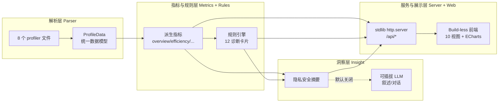
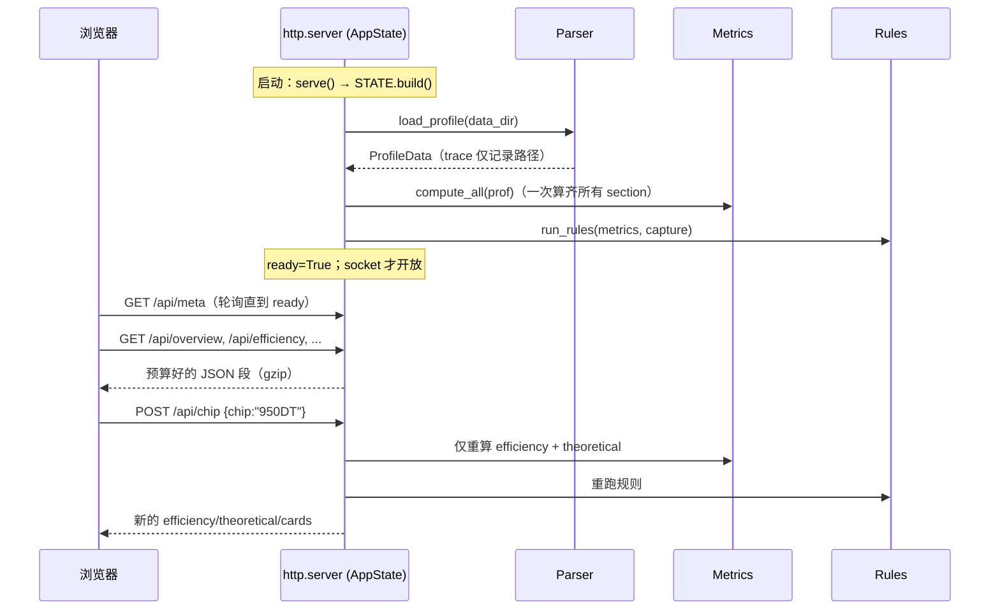

# 02 · 架构与技术取向

> 分层架构、模块结构、技术选型、启动生命周期与数据流、API 端点、芯片切换机制。

## 2.1 分层架构

LLMInsight 分四层，按 `rank × step` 索引（单卡已实现，schema 预留 rank 维度）：



- **解析层 Parser**：CSV → 表结构；`trace_view.json` 流式解析；`communication.json` 归一化 → 统一「ProfileData 数据模型」。详见 [03](03-data-and-parsing.md)。
- **指标 & 规则层**：派生指标（重叠率、MFU/MBU、host/device bound、模块归因）+ 规则引擎（阈值触发洞察）。详见 [04](04-metrics.md) / [06](06-insights-and-llm.md)。
- **洞察层 LLM**：指标摘要 → 可插拔 LLM 后端生成自然语言诊断；默认关闭，规则引擎独立可用。详见 [06](06-insights-and-llm.md)。
- **服务 & 展示层**：纯 stdlib HTTP 后端（切片 / 聚合）+ Web 前端（仪表盘 / 图表 / 时间线）。

## 2.2 模块结构

```
llminsight/
├── config.py              # 芯片峰值预置、模型配置、dtype 字节、路径；set_chip 切换
├── cache.py               # 按文件签名的磁盘 JSON 缓存（重启 ~0.09s）
├── parser/
│   ├── profile.py         # load_profile → ProfileData（8 文件）
│   ├── trace.py           # trace_view.json 流式 iter_events（104MB 不入内存）
│   ├── shapes.py          # "Input Shapes"/dtypes 字符串解析、numel
│   └── derive.py          # 从 profiling 反推模型结构 + 训练/采集配置（不依赖启动脚本）
├── metrics/
│   ├── build.py           # compute_all 编排（一次算齐所有 section）
│   ├── core.py            # overview/hotspots/communication/hidden_overhead/
│   │                      #   attribution/memory/theoretical
│   ├── efficiency.py      # MFU/MBU/Roofline + FlashAttention FLOP 模型 + 峰值校准
│   └── timeline.py        # 泳道占用 + overlap 段 + 频率（流式，缓存）
├── rules/
│   └── engine.py          # 诊断卡片（消费 parser.derive 反推的配置，不再解析脚本）
├── insight/
│   ├── provider.py        # 可插拔 LLM 客户端（OpenAI 兼容 + Anthropic），默认关闭
│   ├── summarizer.py      # 隐私安全摘要 + prompt 构造（只发 KB 级 JSON）
│   └── __init__.py        # generate_insights（卡片 + 可选叙述）
└── server/
    ├── app.py             # AppState + 路由 + 静态文件（ThreadingHTTPServer）
    └── __main__.py        # `python -m llminsight.server` CLI

web/                       # 无构建前端
├── index.html             # 应用外壳（侧栏 / topbar / views 容器）
├── css/app.css            # 单一暗色主题样式表
├── js/util.js             # 全局 LI 命名空间：api/fmt/esc/el/ECharts 封装
├── js/views.js            # LI.views[*]：10 个视图渲染器
├── js/app.js              # 引导 / 导航 / 路由 / 芯片切换
└── vendor/echarts.min.js  # 离线 ECharts 5.5.1（无 CDN 依赖）

scripts/
├── verify.py              # 后端数值基线断言
└── verify_web.js          # 无头渲染校验（10 视图 + undefined 泄漏检查）
```

## 2.3 技术取向（为什么这样选）

| 选择 | 理由 |
|---|---|
| **Python 3 stdlib `http.server`（无 FastAPI）** | 零三方依赖，`python -m llminsight.server` 即可跑，**可独立分发**到任何机器 |
| **无构建前端（vanilla JS + 全局 `LI` 命名空间）** | 无 npm / webpack / 打包步骤，直接静态文件served；改完刷新即生效 |
| **ECharts 5.5.1 本地 vendored** | 离线可用、无 CDN 依赖；缺失时回落 CDN |
| **启动时一次算齐 + 磁盘缓存** | 解析在启动时完成并缓存，重启 ~0.09s；每个 `/api/*` 返回预算好的 JSON 段 |
| **trace 流式、永不入内存** | 104MB / 34 万事件用生成器逐事件处理，内存占用恒定 |
| **pandas 仅用于 CSV** | CSV 表格处理用 pandas；trace 用 stdlib `json` 流式 |

> 运行依赖仅 `pandas` + `numpy`（见 `requirements.txt`）；服务器 / LLM 客户端 / 报告导出均纯 stdlib。前端零依赖。

## 2.4 启动生命周期与数据流



要点：
- **socket 在 profile 解析完成后才开放**，所以冷缓存首启（104MB trace）可能耗时；前端轮询 `/api/meta` 直到 `ready:true`。
- **LLM 调用从不在启动时发生**。`GET /api/insights` 只返回规则卡片 + 摘要（`narrative=null`）；只有显式 `POST /api/llm` 才触发网络调用，且仅当启用 + 有 key。

## 2.5 磁盘缓存

`cache.py` 按**文件签名**（路径 + mtime + size）缓存计算结果到 `.llminsight_cache/`。timeline 等重计算段命中缓存后重启近乎瞬时。签名变化（数据更新）自动失效。

## 2.6 芯片切换机制（H5 支撑）

右上角芯片下拉触发 `POST /api/chip`：

1. `set_chip(key)` 仅**重新指向**共享的 `CHIP_PRESETS[key]` 实例（绝不原地修改预置，保证确定性）。
2. 仅重算**芯片相关**段：`efficiency` + `theoretical`（+ 重跑规则卡片）。
3. step 时间构成、热点、通信、时间线等**芯片无关**段原样保留。
4. 前端清除这些段的客户端缓存，重渲染当前视图（`CHIP_VIEWS = overview / efficiency / insights / memory`）。

预置见 [03](03-data-and-parsing.md) / `config.py`：`910B`（保守默认）与 `950DT`（1 PFLOPS BF16、4 TB/s、96 GB）。

## 2.7 API 端点

所有 `/api/*` 返回 JSON；`ready` 之前除 `/api/meta` 外返回 503。

| 方法 | 路径 | 内容 |
|---|---|---|
| GET | `/api/meta` | 就绪状态、加载耗时、设置（含芯片下拉数据）、LLM 状态、数据目录 |
| GET | `/api/overview` | step 时间构成与关键比率 |
| GET | `/api/hotspots` | Top 算子 + 按 Core 类型聚合 |
| GET | `/api/efficiency` | MFU/MBU/Roofline 散点 + 优化余量排行 + 芯片峰值 |
| GET | `/api/communication` | 集合通信耗时 / 等待占比 / 带宽（按类型聚合） |
| GET | `/api/hidden_overhead` | 隐性开销分桶（device/host/config） |
| GET | `/api/attribution` | 模型结构归因 + MoE 专项 |
| GET | `/api/memory` | 显存现状 + 配置驱动的内存-时间权衡 |
| GET | `/api/theoretical` | 理论上界 + What-if + compute-bound |
| GET | `/api/timeline` | 泳道占用 + overlap 段 + 频率 |
| GET | `/api/insights` | 规则卡片 + 隐私安全摘要（`narrative=null`，不触发 LLM） |
| GET | `/api/all` | 全部 metrics（调试用） |
| POST | `/api/chip` | `{"chip":"950DT"}` 切换参考芯片，返回重算结果 |
| POST | `/api/llm` | **唯一**的 LLM 触发；返回叙述或清晰的「未启用 / 报错」原因 |

非 `/api/*` 路径走静态文件（`web/`，SPA 回落 `index.html`）；含路径穿越防护。

---

上一篇：[01 · 总览与目标](01-overview-and-goals.md) ｜ 下一篇：[03 · 数据与解析](03-data-and-parsing.md)
