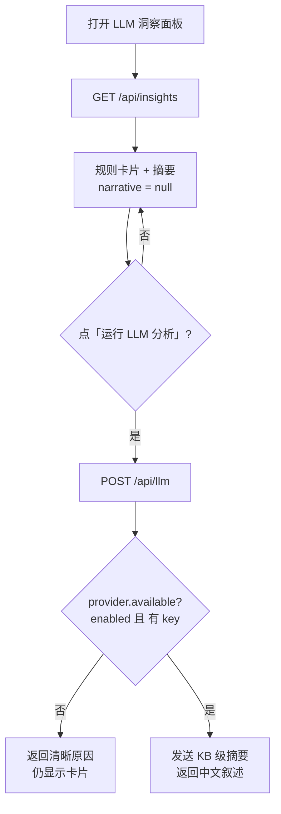

# 06 · 洞察与 LLM

> 规则引擎 12 条诊断卡片（事实依据）+ 可插拔、默认关闭的 LLM 叙述层（增强）。

## 6.1 设计原则

- **规则引擎是事实底座**：命中项 + 昇腾最佳实践，让建议可执行、降低 LLM 幻觉。
- **LLM 是可选增强**：未配置任何 LLM 时，规则引擎 + 全部可视化照常工作（优雅降级）。
- **隐私优先**：只把**结构化指标摘要**（KB 级 JSON）发给 LLM，**绝不上传原始 104MB trace**。
- **默认关闭、独立分发**：网络调用默认 no-op；软件可在任何机器独立运行，不依赖任何特定环境。

## 6.2 规则引擎：诊断卡片

`rules/engine.py::run_rules` 读 metrics 字典 + 训练脚本配置（`read_capture_config` 解析 `export VAR=` 与 `--flag`，并解析 `${VAR}` 引用），输出卡片。卡片结构：

```python
{ "id", "severity"(high/medium/low/info), "category", "title",
  "root_cause", "suggestion", "expected_gain", "confidence", "evidence" }
```
卡片按 `(severity, confidence)` 降序排序。

### 12 条洞察清单

| # | id | 严重度 | 类别 | 触发条件（要点） | 置信 |
|---|---|---|---|---|---|
| 1 | `comm_not_overlapped` | high | 通信 | 未掩盖通信 ≥10% 或 重叠率 <40% | 0.9 |
| 2 | `aicpu_dispatch` | high | 下发 | `HcclLaunchAicpuKernel` 占比 ≥10% | 0.85 |
| 3/11 | `capture_blocking` | high | 采集体检 | `ASCEND_LAUNCH_BLOCKING=1` | 1.0 |
| 4 | `dynamic_shape` | medium | 动态shape | MaskedSelect/NonZero host 累计 >50ms | 0.7 |
| 5a | `low_efficiency_ops` | medium | 算子效率 | 存在 `wasted_us>0` 的 Top 候选 | 0.6 |
| 5b | `peak_underestimated` | info | 算子效率 | 实测 matmul 峰值 > 假设峰值（已校准） | 0.8 |
| 6 | `free_bubble` | medium | 空泡 | `free_pct ≥10%` | 0.65 |
| 7 | `recompute_full` | low | 显存-时间 | `--recompute-granularity full` | 0.6 |
| 8 | `hidden_overhead_ledger` | medium | 隐性开销 | hidden_overhead 可用 | 0.7 |
| 9 | `theoretical_whatif` | info | 理论上界 | theoretical 可用（取最优 What-if） | 0.7 |
| 10 | `parallelism_advisor` | medium | 并行策略 | 有 EP 且未掩盖通信 ≥15% | 0.55 |
| 12 | `memory_capture` | info | 显存 | 无 memory-level 采集 | 0.9 |

> 这 12 条正是验证目标（见 [07](07-roadmap-and-verification.md)）；样例上全部命中。每条都带 `evidence`（触发它的原始数字），既给 UI 也给 LLM 做事实依据。

### 代表性洞察（样例命中）

- **通信掩盖严重不足**：未掩盖 26% / 重叠率 12.6% → 核对 `--moe-fb-overlap` / `--moe-permutation-async-comm`，扩大重叠窗口。
- **AICPU 通信下发过高**：`HcclLaunchAicpuKernel` 占 device 28% → EP64 alltoall 启动密集；调 `HCCL_BUFFSIZE` / 通信算法、减少 dispatch、评估 EP 规模。
- **采集配置扭曲**：检测 `ASCEND_LAUNCH_BLOCKING=1` → 标注 host 同步数字「不可直接采信」，给正确复采方式（置信度 1.0）。
- **芯片峰值假设偏低**：实测 matmul 峰值 ≈432 > 假设 376 TFLOPS → 已按实测上界校准；建议在 `ChipSpec` 填真实 SKU 峰值。

## 6.3 LLM 洞察层

### 6.3.1 调用门控（默认关闭、显式触发）



- `GET /api/insights` 用 `call_llm=False`：**仅打开面板从不消耗 LLM 请求**。
- `POST /api/llm` 是**唯一**触发；任何失败（网络 / 鉴权 / 解析）降级为「仅卡片 + 错误原因」。

### 6.3.2 可插拔 Provider（`insight/provider.py`）

纯 stdlib `urllib`（无三方 SDK），以 **OpenAI 兼容**为统一抽象，外加 **Anthropic** 适配器。预置后端：

| provider | base_url | 默认 model | 协议 |
|---|---|---|---|
| `glm`（默认） | open.bigmodel.cn | glm-4-flash | openai |
| `deepseek` | api.deepseek.com | deepseek-chat | openai |
| `openai` | api.openai.com | gpt-4o-mini | openai |
| `siliconflow` | api.siliconflow.cn | Qwen2.5-7B-Instruct | openai |
| `ollama`（本地，免 key） | localhost:11434 | qwen2.5 | openai |
| `anthropic` | api.anthropic.com | claude-3-5-haiku | anthropic |

一处配置即可切换，不锁死任何一家；本地 Ollama / vLLM / MindIE 可离线、数据不出内网。

### 6.3.3 环境变量开关

| 变量 | 作用 | 默认 |
|---|---|---|
| `LLMINSIGHT_LLM_ENABLED` | `1` 开启调用 | **关（0）** |
| `LLMINSIGHT_LLM_PROVIDER` | glm / deepseek / openai / siliconflow / ollama / anthropic | glm |
| `LLMINSIGHT_LLM_MODEL` | 覆盖模型 id | 预置 |
| `LLMINSIGHT_LLM_BASE_URL` | 覆盖端点 | 预置 |
| `LLMINSIGHT_LLM_API_KEY` | key（否则回落 `secret/api_key.txt`） | — |

> **分发约定**：代码层 `enabled` **默认 False**，确保分发给他人时（无 key）零网络调用、纯规则引擎可用。本地开发的 `restart_insight.sh` 会显式置 `1`（本机已授权的 key 在 `secret/api_key.txt`，永不入库 / 永不打印）。

### 6.3.4 隐私安全摘要（`insight/summarizer.py`）

`build_summary` 产出**就是 LLM 看到的确切 payload**（服务端暴露给用户审计）：
- 只含聚合数字 + 规则卡片；**绝不含** raw trace、张量数据、文件路径、用户名、完整环境。
- 采集配置经**白名单**过滤：env 仅 `ASCEND_LAUNCH_BLOCKING / HCCL_BUFFSIZE / …`，flags 仅性能相关开关。
- system prompt 把 LLM 定位为「昇腾 NPU 训练调优专家」，要求**只用给定数据、不臆造数字**，建议落地到具体开关 / 参数，并对被 blocking 放大的 host 指标标注采集干扰。

### 6.3.5 后续增强（设计到位、待接线）

对话式追问（「为什么 alltoall 这么贵」）、昇腾最佳实践知识库、Timeline 自动导读（在 34 万事件上自动标注「此处 alltoall 卡顿」「此处重计算开始」）—— 接口已预留，按 [07](07-roadmap-and-verification.md) 的 P3/P4 推进。

---

上一篇：[05 · 展示视图](05-views.md) ｜ 下一篇：[07 · 路线图与验证](07-roadmap-and-verification.md)
