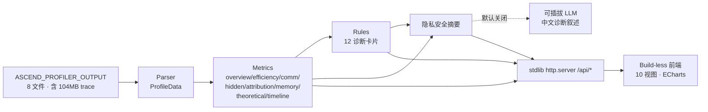

# LLMInsight 设计文档

> **昇腾（Ascend）NPU 大模型训练 Profiling 与性能洞察平台** —— 设计总入口。
>
> 把一份 `ASCEND_PROFILER_OUTPUT` 目录，零配置地解析为统一数据模型、派生指标、运行规则引擎，并通过无构建 Web 仪表盘呈现「现象 → 根因 → 建议 → 预计收益 → 置信度」式的可执行洞察。

本文档按设计层次拆为多篇，本页是**入口与导航**。当前实现对象为 **DeepSeek-V3 结构 MoE 模型（MLA + 128 专家、EP64）单卡单 step** 采集。

## 文档导航

| 篇章 | 内容 | 读它来回答 |
|---|---|---|
| [01 · 总览与目标](01-overview-and-goals.md) | 背景动机、现有工具盲区、差异化定位、亮点 H1–H10 / 基础 G1–G4 / 多卡 M1–M5 目标 | 这是什么？为什么不用现有工具？ |
| [02 · 架构与技术取向](02-architecture.md) | 分层架构、模块结构、技术选型、启动生命周期、API 端点、芯片切换 | 系统怎么搭的？数据怎么流？ |
| [03 · 数据与解析](03-data-and-parsing.md) | 8 文件能力映射、ProfileData 模型、CSV 清洗 / trace 流式、维度预留、校验基线 | 输入是什么？怎么解析的？ |
| [04 · 指标层](04-metrics.md) | 各分析段口径与公式：MFU/MBU/Roofline、FlashAttention FLOP 模型、峰值校准、隐性开销、归因、What-if | 每个数字怎么算出来的？ |
| [05 · 展示视图](05-views.md) | 前端 10 视图、数据源、现状、前端外壳约定 | 界面上能看到什么？ |
| [06 · 洞察与 LLM](06-insights-and-llm.md) | 规则引擎 12 卡片、可插拔 LLM 后端、隐私契约、默认关闭、优雅降级 | 诊断怎么来的？LLM 怎么接？ |
| [07 · 路线图与验证](07-roadmap-and-verification.md) | 分阶段 P0–P5（含状态）、单卡 / 多卡、数值 + 渲染双重验证 | 做到哪了？怎么保证不退化？ |

## 系统全景



## 四大差异化亮点

1. **LLM 自动诊断**（H1）—— 把「专家盯 trace」变成「问一句就有结论」。
2. **全训练回放**（H2）—— 像回放录像一样定位训练劣化时刻。
3. **训练语义化归因**（H3）—— 算子 / 通信归因到 MLA / MoE / Norm / Optimizer。
4. **开箱即用**（H4）—— 指向目录即自动解析 → 出图 → 出洞察。

外加 **MFU/MBU + Roofline 优化余量**（H5）、**隐性开销专项**（H6）、**理论上界 + What-if**（H7）、**显存权衡**（H8）、**并行策略顾问**（H9）。详见 [01](01-overview-and-goals.md)。

## 当前状态速览

| 维度 | 状态 |
|---|---|
| 数据解析（P0） | ✅ 8 文件 → ProfileData，trace 流式不入内存 |
| 核心可视化（P1） | ✅ 10 视图（显存 / 回放为骨架，待采集补全） |
| 分析引擎（P2） | ✅ 规则引擎 12 卡片 + 归因 + What-if + 采集体检 |
| LLM 洞察（P3） | ✅ Provider 抽象 + 摘要构造 + 客户端已实现，**默认关闭** |
| 全程化 / 多卡（P4–P5） | ⏳ 待多 step / 多卡数据 |

## 快速开始

```bash
pip install -r requirements.txt          # 运行依赖仅 pandas + numpy（前端零依赖）

# 默认数据目录指向仓库内置样例（可用 LLMINSIGHT_DATA_DIR 覆盖）
python -m llminsight.server              # 默认 127.0.0.1:8000，自动开浏览器
python -m llminsight.server --port 8765 --no-browser
# 本地开发可用 ./restart_insight.sh（自动停旧起新 + 轮询就绪）
```

首次启动会解析 104MB trace（socket 在解析完成后才开放）；之后磁盘缓存使重启 ~0.09s。

## 关键约束

- **单卡优先**：当前单卡单 step；数据模型按 `rank × step` 预留多卡。
- **LLM 默认关闭**：代码层默认 `enabled=False`，分发给无 key 用户时纯规则引擎可用、零网络调用。
- **隐私优先**：只把 KB 级**结构化摘要**发给 LLM，**绝不上传原始 trace**；摘要在 UI 可审计。
- **芯片峰值为假设值**：MFU/MBU/Roofline 随芯片峰值缩放，UI 标注「假设」并可在右上角切换（910B / 950DT）或在 `config.ChipSpec` 校正。
